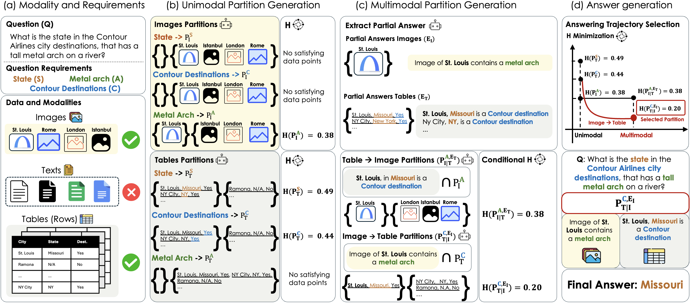
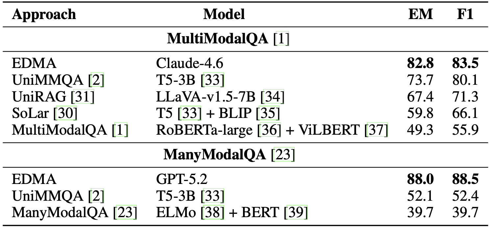
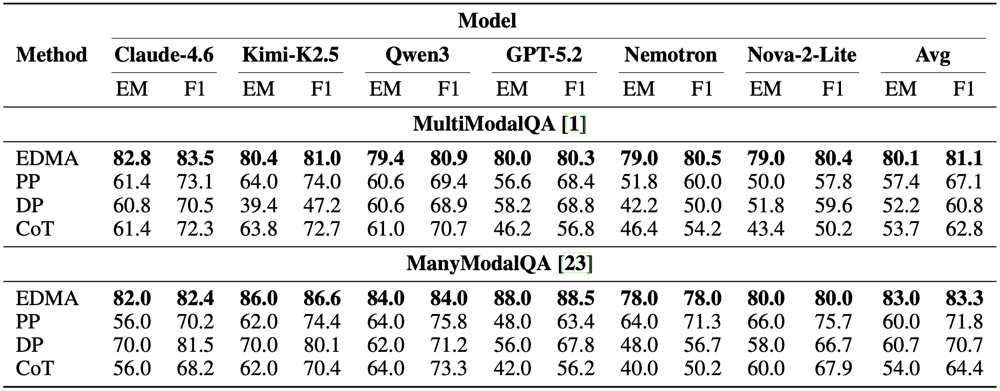
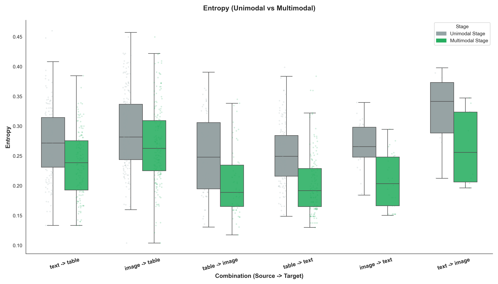
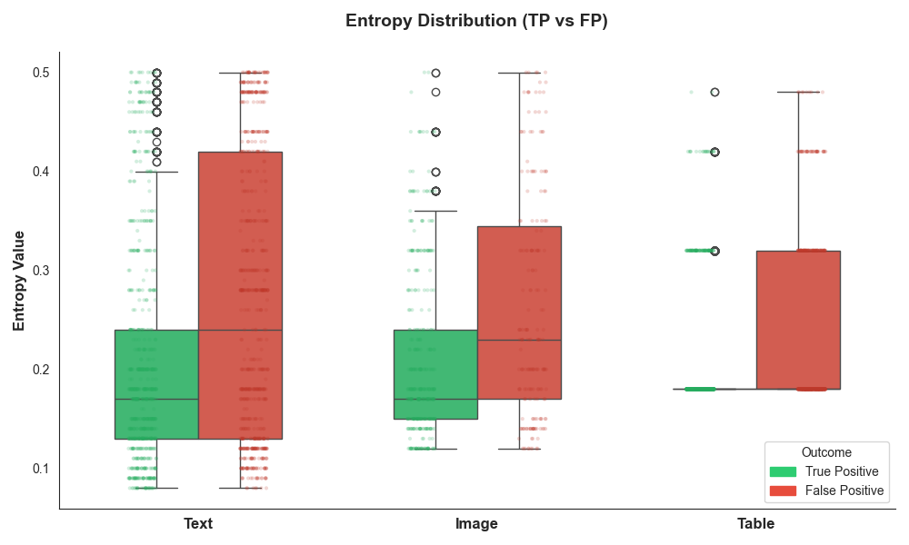
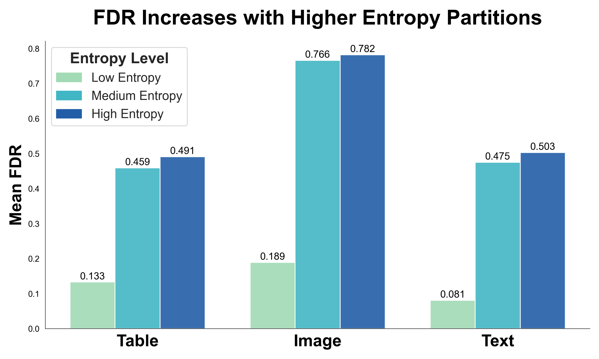

# EDMA



EDMA is a novel methodology designed to improve Large Language Model inference capability in multimodal QA settings, where integration of information from multiple sources is required to correctly answer questions. 

EDMA is the first approach that quantifies and traces the contribution of each modality to the reduction of uncertainty over possible answer choices.

We evaluate EDMA using both closed-source and open-source LLMs. Our method improves state-of-the-art performance, outperforming both specialised systems and existing prompting strategies.

---

# Performance Results




# Analysis of the Results
<table>
  <tr>
    <td align="center">
      <br>
      <em>Entropy decrease</em>
    </td>
    <td align="center">
      <br>
      <em>Entropy TP vs Entropy FP</em>
    </td>
    <td align="center">
      <br>
      <em>FDR Across Entropy Levels</em>
    </td>
  </tr>
</table>

## 🚀 Installation

1. Clone the repository and install dependencies:

```bash
git clone https://github.com/EMezzi/LEGuidance.git
cd LEGuidance
pip install -r requirements.txt
pip install -e .
```
2. Environment setup

```bash
cp .env.example .env
```
### API KEYS
`OPENAI_KEY`=your_openai_key_here <br/>
`AWS_ACCESS_KEY_ID`=your_aws_key_here <br/>
`AWS_SECRET_ACCESS_KEY`=your_aws_secret_here

### PATHS
`DATA_ROOT`=/path/to/datasets <br/>
`RESULTS_ROOT`=./results

# Data Preprocessing
Before running experiments, you must preprocess the datasets to generate the required modality-specific files (text, images, tables).
This step prepares the data in the format expected by the EDMA pipeline and for all other approaches (DP, CoT, PP).

```bash
python association_dir.py --dataset all --setting validation
```

| Argument    | Description           | Options                              | Default      |
|-------------|-----------------------|--------------------------------------|--------------|
| `--dataset` | Dataset to preprocess | `multimodalqa`, `manymodalqa`, `all` | **required** |
| `--setting` | Dataset split         | `training`, `validation`             | `validation` |


# Use
▶️ Running Experiments
The main script supports multiple datasets, models, and approaches.
Basic usage

| Argument     | Description                            | Options                        | Default        |
|--------------|----------------------------------------|--------------------------------|----------------|
| `--dataset`  | Dataset to use                         | `multimodalqa`, `manymodalqa`  | `multimodalqa` |
| `--setting`  | Dataset split                          | `training`, `validation`       | `validation`   |
| `--approach` | Inference approach                     | `dp`, `cot`, `pp`, `le`, `all` | `all`          |
| `--models`   | Models to evaluate                     | list of model IDs              | `gpt-5.2`      |
| `--backend`  | API backend                            | `openai`, `bedrock`            | `openai`       |
| `--seed`     | Random seed for reproducibility        | int                            | `42`           |
| `--limit`    | Limit number of questions (debug mode) | int                            | None           |


## Examples
Run all approaches with GPT-5.2:
```bash
python main.py --dataset multimodalqa --setting validation --approach all --models gpt-5.2 --seed 42
```
Run only Chain-of-Thought:
```bash
python main.py --dataset multimodalqa --setting validation --approach cot --models gpt-5.2
```
Run Logical Entropy pipeline:
```bash
python main.py --dataset multimodalqa --setting validation --approach le --models gpt-5.2
```
Run Bedrock models:
```bash
python main.py --dataset multimodalqa --setting validation --approach all --backend bedrock
```